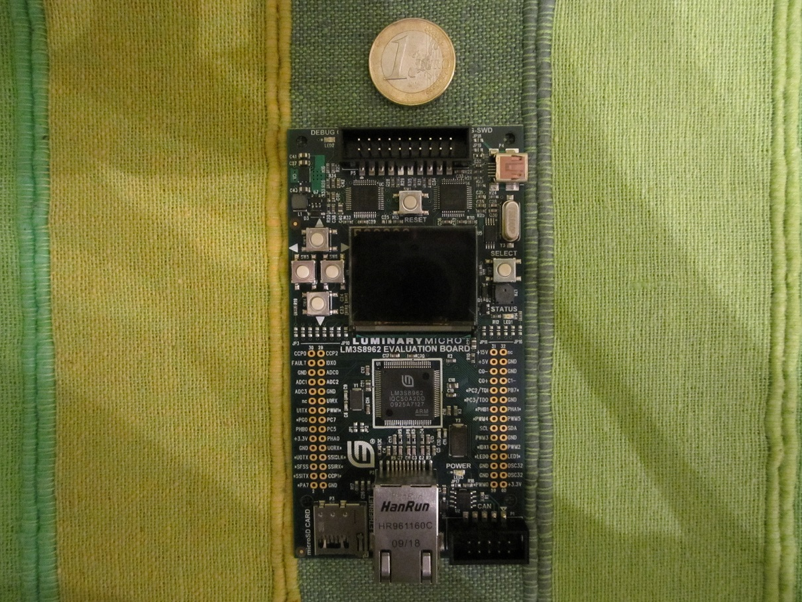

A new order picking system with CAN fieldbus system for intelligent warehouses

A first prototype has been presented (http://youtu.be/D7ay7wDk1Wo). For the demonstration, we used a PCAN-USB adapter (PEAK-System) which enables connection from PC to CAN network, and an ARM Cortex-M3 microcontroller. Concretely, a Stellaris LM3S8962 from Texas Instruments (see image). 

Previously, the microcontroller was programmed with a code (canmicrocontroller.c) using CooCox IDE. Likewise, a standalone application written in C++ language (pccan.cpp) with NetBeans IDE that was running on PC. This application sends a CAN message on the bus line with the information about products quantity, worker, and ID DPD. Then, a CAN message arrives to the microcontroller that functions as a DPD. The worker confirms by pressing a button of the microcontroller. Finally, the microcontroller generates a CAN message that returns to PC application.
